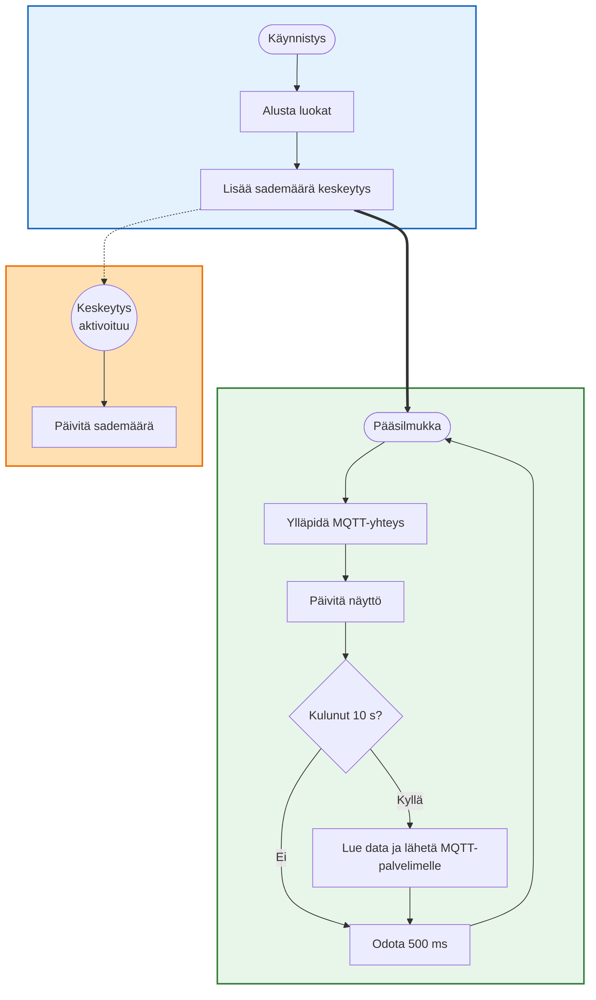

# Arduino sääasema

```mermaid
flowchart TD
    %% ALUSTUS (Laatikko 1)
    subgraph Alustus [" "]
        direction TB
        S1([Käynnistys]) --> S2[Alusta luokat]
        S2 --> S3[Lisää sademäärä keskeytys]
    end

    %% PÄÄOHJELMA (Laatikko 2)
    subgraph Paaohjelma [" "]
        direction TB
        L1([Pääsilmukka]) --> L2[Ylläpidä MQTT-yhteys]
        
        L2 --> L4[Päivitä näyttö]
        L4 --> L5{Kulunut 10 s?}
        
        L5 -- Kyllä --> L6[Lue data ja lähetä MQTT-palvelimelle]
        L5 -- Ei ---> L7[Odota 500 ms]
        
        L6 --> L7
        L7 --> L1
    end

    %% KESKEYTYS (Laatikko 3)
    subgraph Keskeytys [" "]
        direction TB
        I1((Keskeytys<br>aktivoituu)) --> I2[Päivitä sademäärä]
    end

    %% Yhteydet lohkojen välillä
    S3 ===> L1

    %% Sivuttaiset yhteydet
    S3 -.-> I1

    %% Laatikoiden tyylittely
    style Alustus fill:#E3F2FD,stroke:#1565C0,stroke-width:2px
    style Paaohjelma fill:#E8F5E9,stroke:#2E7D32,stroke-width:2px
    style Keskeytys fill:#FFE0B2,stroke:#EF6C00,stroke-width:2
```
